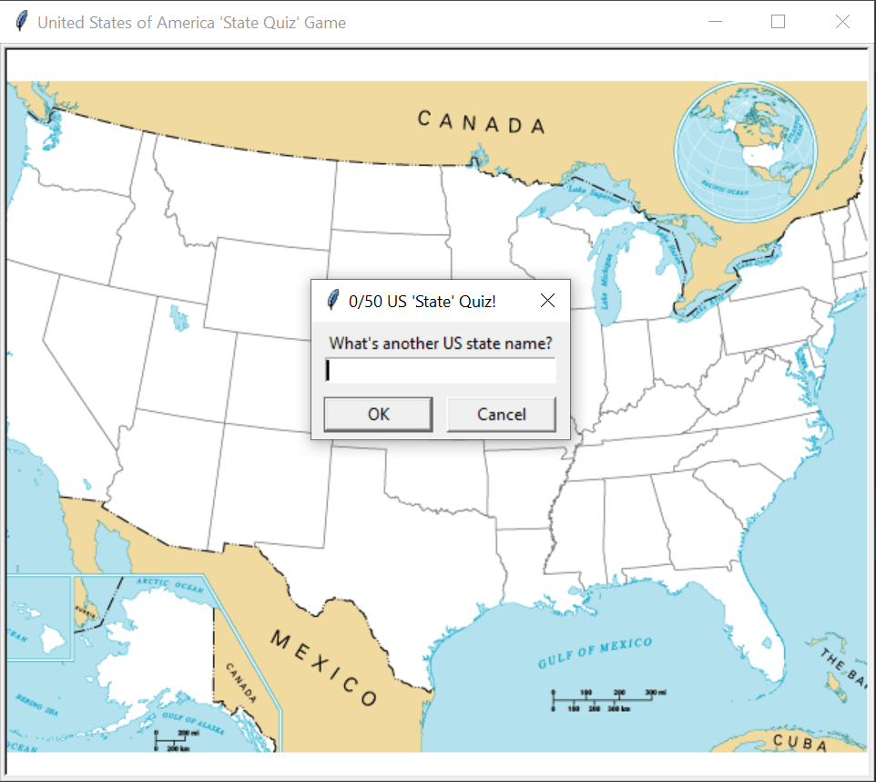

_This README.md file is in English and Portuguese. // Esse arquivo README.md está em Inglês e Português._

# EN: US States Quiz Game

⚠️ _This was done as I followed up Angela Yu's Python Bootcamp tutorial on the Pong Game. You can find the course [on Udemy here](https://www.udemy.com/course/100-days-of-code/)._ ⚠️

Try to guess all 50 states from the United States. If you type "exit", the game will close and a CSV file will be created containing all missed states for you to learn. 

This game was created with Python Turtle Module and Pandas package. A map of the United States is laid in front of the user with a prompt question: "What's another U.S. state name?". Each time the user answers a correct U.S. state name, the name is written on the map at the exact location. For each correct guess, the prompt title will increase. Done as part of Angela Yu's Bootcamp.

To exit the game please type "exit".

---

# PT: Quiz dos estados dos EUA

 ⚠️ _Isso foi criado enquanto eu seguia o tutorial do Jogo da Cobrinha do Bootcamp de Python da Angela Yu. O curso está [disponível na Udemy aqui](https://www.udemy.com/course/100-days-of-code/)_. ⚠️

Tente adivinhar os 50 estados dos Estados Unidos. Se você digitar "exit" (sair), o jogo vai fechar e um arquivo CSV será criado contendo todos os estados que faltaram, para ajudar a aprender. 

Esse jogo foi criado usando o Turtle Module do Python e a biblioteca Pandas. Um mapa dos Estados Unidos fica diante do usuário com a pergunta: "Qual é outro nome de estado dos EUA?". Cada vez que o usuário responde corretamente um nome, o nome vai ser escrito no map na localidade exata. Para cada tentativa correta, o título da caixa de pergunta aumenta uma unidade. Feito como parte do Bootcamp Angela Yu.

Para sair do jogo por favor digite "exit". 
